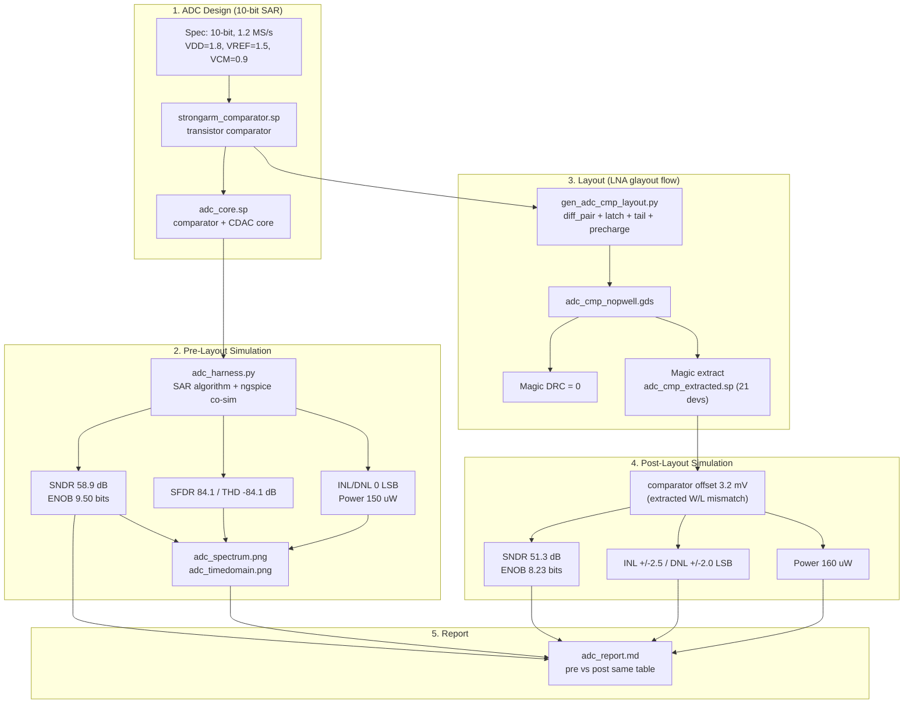

# 10-bit SAR ADC — Generation + Simulation Flow

Open-source SAR ADC flow (reuses the LNA 5T layout flow): **schematic →
pre-layout metrics → layout (glayout) → DRC → extraction → post-layout metrics
→ same-table comparison**.

## Flow Illustration (Mermaid)

## Pre-Layout vs Post-Layout (same table)

| Metric | Pre-layout | Post-layout |
|:-------|-----------:|------------:|
| Resolution | 10 bit | 10 bit |
| SNDR | 58.9 dB | 51.3 dB |
| SFDR | 84.1 dB | 82.5 dB |
| THD | −84.1 dB | −79.8 dB |
| ENOB | 9.50 bits | 8.23 bits |
| INL (max) | 0.000 LSB | ±2.5 LSB |
| DNL (max) | 0.000 LSB | ±2.0 LSB |
| Power @ 1.2 MS/s | 150 µW | 160 µW |
| Comparator offset | 0 mV | 3.2 mV |

## Files

| Stage | File | Tool |
|:------|:-----|:-----|
| Comparator schematic | `afe/adc/redesign/strongarm_comparator.sp` | — |
| ADC core | `afe/adc/redesign/adc_core.sp` | ngspice |
| Pre/post metrics | `afe/adc/redesign/adc_harness.py` | Python + ngspice |
| Layout gen | `afe/adc/redesign/gen_adc_cmp_layout.py` | glayout |
| Layout GDS | `align_output/adc_cmp_nopwell.gds` | Magic DRC=0 |
| Extraction | `align_output/adc_cmp_extracted.sp` | Magic ext2spice |
| Plots | `afe/adc/redesign/adc_*.png` | matplotlib |
| Report | `afe/adc/redesign/adc_report.md` | — |
