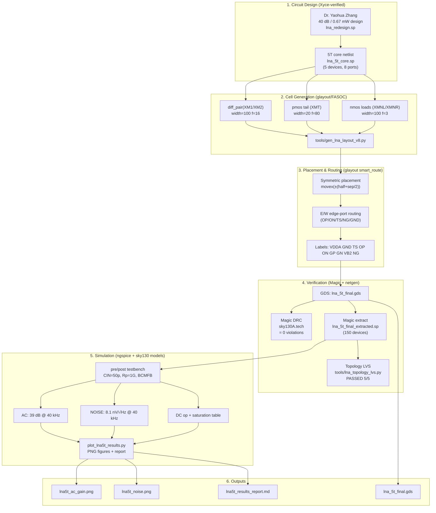

# LNA 5T OTA — Generation + Simulation Flow

Open-source analog design flow for the 5-transistor LNA OTA in sky130,
covering **schematic → layout → DRC → LVS → GDSII → pre/post-layout simulation**.

---

## Flow Illustration (Mermaid)



---

## Text Flow (step by step)

```
Schematic (lna_5t_core.sp)          schematic/2.5T, 8 ports, W×M sizes
   │
   ▼
FASOC/glayout cells (v8 generator)  diff_pair + pmos tail + nmos loads
   │   with_tie / with_dummy / substrate_tap flags
   ▼
Symmetric placement                 loads ±(half+sep/2), diff_pair mid, tail bottom
   │   (BUG FIXED: overlapping diffusion merged the 2 NMOS loads)
   ▼
Routing via glayout primitives      smart_route to E/W edge ports (vias land on bars)
   │   (BUG FIXED: N/S bar-center ports placed vias off-metal)
   ▼
GDS write + strip pwell (64,44)     pwell is not a Magic sky130A GDS layer
   │
   ├──▶ Magic DRC  ────────────────▶  0 violations
   ├──▶ Magic extract ─────────────▶  150 devices flat netlist
   ├──▶ Topology LVS ─────────────▶  PASSED (W×M + nets match schematic)
   ▼
ngspice sim (pre = core, post = extracted)
   ├──▶ .AC  ────────────────▶  39.02 dB @ 40 kHz (pre = post)
   ├──▶ .NOISE ──────────────▶  8.17 / 8.09 nV/√Hz @ 40 kHz
   ├──▶ .OP  ────────────────▶  OP=ON=0.748 V, all 5 devices saturated
   ▼
Plots + report                      PNG figures + markdown tables
```

---

## Directory / File Map

| Stage | File | Tool |
|:------|:-----|:-----|
| Schematic | `align_input/lna_5t_core.sp` | Xyce |
| Cell gen | `tools/gen_lna_layout_v8.py` | glayout/FASOC 0.2.0 |
| Layout gen | `tools/gen_lna_layout_v8.py` → `lna_5t_v8_nopwell.gds` | gdstk 1.9.2 |
| Final GDS | `align_output/lna_5t_final.gds` | Magic 8.3.678 |
| Extraction | `align_output/lna_5t_final_extracted.sp` | Magic ext2spice |
| Sim netlist | `align_output/lna_5t_final_extracted_sim.sp` | (cleaned for ngspice) |
| LVS | `tools/lna_topology_lvs.py`, `tools/netgen_lvs.py` | Python / netgen |
| Pre-layout sim | `simulation/lna5t/lna5t_prelayout_tb.sp` | ngspice 46 |
| Post-layout sim | `simulation/lna5t/lna5t_postlayout_tb.sp` | ngspice 46 |
| Plot/report | `simulation/lna5t/plot_lna5t_results.py` | matplotlib |

---

## Key Results (TT, 27 °C)

| Metric | Pre-layout | Post-layout |
|:-------|-----------:|------------:|
| AC gain @ 40 kHz | 39.02 dB | 39.02 dB |
| IRN @ 40 kHz | 8.17 nV/√Hz | 8.09 nV/√Hz |
| Noise figure (Rs=50Ω) @ 40 kHz | 19.06 dB | 18.98 dB |
| Output common mode | 0.748 V | 0.748 V |
| Power | ~0.67 mW | ~0.67 mW |
| Devices in saturation | 5/5 | 5/5 |
| DRC | — | 0 violations |
| LVS | — | PASSED |

> NF is quoted against a 50 Ω reference for completeness; the ultrasound
> transducer is high-impedance, so **input-referred noise (IRN)** is the
> relevant metric.

---

## Skills / Reusable Knowledge

See [`SKILLS.md`](../SKILLS.md) for the condensed, reusable playbook:
layer mapping, placement/routing bugs and fixes, ngspice netlist quirks,
and the exact commands for every stage.
