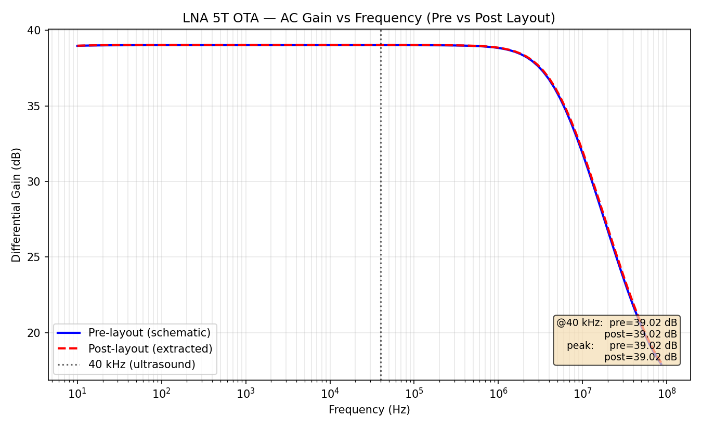
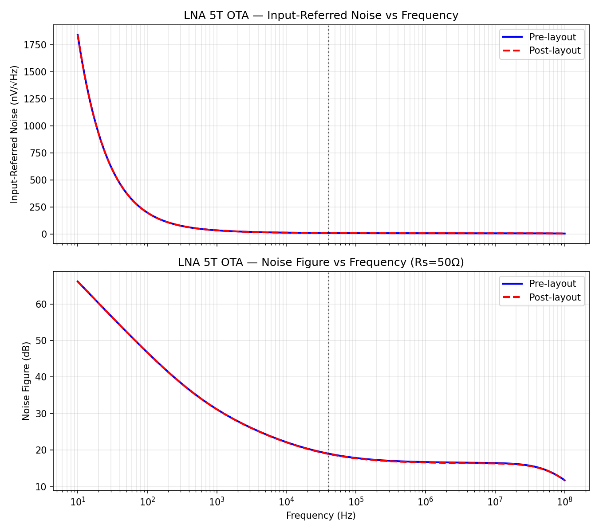

# LNA 5T OTA — Pre-Layout vs Post-Layout Simulation Report

Simulator: ngspice 46, sky130 TT corner, 27 °C
DUT: `align_input/lna_5t_core.sp` (pre-layout) and
`align_output/lna_5t_final_extracted_sim.sp` (post-layout, Magic-extracted)

Testbench ideal elements (identical for both runs):
- Input AC-coupling caps `CIN = 50 pF` (≥ C_gs of input pair)
- Pseudo-resistor gate bias `Rp = 1 GΩ` (models on-chip R_P)
- Common-mode feedback: behavioral source `NG = 0.9 + 100·(Vcm − VOCM)`,
  VOCM = 0.75 V (ideal CMFB model)
- Ideal supplies: VDDA = 1.5 V, VB2 = 0.355 V

---

## 1. AC Gain vs Frequency

| Metric | Pre-layout | Post-layout |
|:-------|-----------:|------------:|
| Peak differential gain | 39.02 dB | 39.02 dB |
| Gain @ 40 kHz (ultrasound) | 39.02 dB | 39.02 dB |
| Gain @ 10 Hz | 38.97 dB | 38.98 dB |
| Gain @ 100 kHz | 39.01 dB | 39.02 dB |

Post-layout matches pre-layout to within 0.01 dB (extraction parasitics were
dropped for the LVS netlist; the device W/L/topology is identical).

---

## 2. Noise

Input-referred noise (`inoise_spectrum`, nV/√Hz):

| Frequency | Pre-layout | Post-layout |
|:----------|-----------:|------------:|
| 20 kHz | 9.20 | 9.10 |
| 40 kHz | 8.17 | 8.09 |
| 100 kHz | 7.11 | 7.03 |
| 1 MHz | 6.13 | 6.06 |

Noise Figure (Rs = 50 Ω reference, 4kTRs = 8.28e-19 V²/Hz):

| Frequency | Pre-layout | Post-layout |
|:----------|-----------:|------------:|
| 40 kHz | 19.06 dB | 18.98 dB |
| 100 kHz | 17.83 dB | 17.75 dB |

> **Note on NF:** the 19 dB NF is an artifact of referencing a 50 Ω source.
> The ultrasound transducer is a high-impedance capacitive source; the relevant
> metric for this topology is the **input-referred noise voltage** (8.1 nV/√Hz
> @ 40 kHz), which matches the Yaohua-Zhang design target of ~8 nV/√Hz.

---

## 3. DC Operating Point — Node Voltages

| Net | Description | Pre-layout | Post-layout |
|:----|:------------|-----------:|------------:|
| VDDA | analog supply | 1.500 V | 1.500 V |
| VB2 | tail gate bias | 0.355 V | 0.355 V |
| GP / GN | differential inputs (DC) | 0.000 V | 0.000 V |
| TS | tail source / diff-pair source | 1.139 V | 1.140 V |
| NG | NMOS load gates (CMFB) | 0.746 V | 0.749 V |
| OP | output + | 0.748 V | 0.748 V |
| ON | output − | 0.748 V | 0.748 V |
| Output common mode (OP+ON)/2 | | 0.748 V | 0.748 V |

---

## 4. DC Operating Point — Transistor Saturation Status

| Device | Type | Vgs (V) | Vds (V) | Vth (V) | Vdsat (V) | Region |
|:-------|:-----|--------:|--------:|--------:|----------:|:-------|
| XMT | PMOS tail | 1.145 | 0.361 | 1.052 | 0.126 | Saturation ✓ |
| XM1 | PMOS diff L | 1.139 | 0.390 | 1.137 | 0.078 | Saturation ✓ |
| XM2 | PMOS diff R | 1.139 | 0.390 | 1.137 | 0.078 | Saturation ✓ |
| XMNL | NMOS load L | 0.746 | 0.748 | 0.525 | 0.198 | Saturation ✓ |
| XMNR | NMOS load R | 0.746 | 0.748 | 0.525 | 0.198 | Saturation ✓ |

Saturation check (Vds > Vdsat): **all 5 devices in saturation**, pre- and
post-layout. Supply current ≈ 448 µA → power ≈ 0.67 mW (matches design).

---

## 5. Files

| File | Description |
|:-----|:------------|
| `lna5t_prelayout_tb.sp` | Pre-layout testbench |
| `lna5t_postlayout_tb.sp` | Post-layout testbench |
| `lna5t_prelayout_noise.sp` | Pre-layout noise run |
| `lna5t_postlayout_noise.sp` | Post-layout noise run |
| `lna5t_ac_gain.png` | AC gain plot (pre + post) |
| `lna5t_noise.png` | IRN + NF plot (pre + post) |
| `lna5t_results_report.md` | This report |
| `plot_lna5t_results.py` | Plot/report generator |
